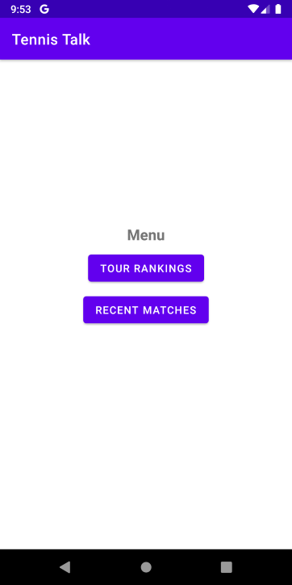
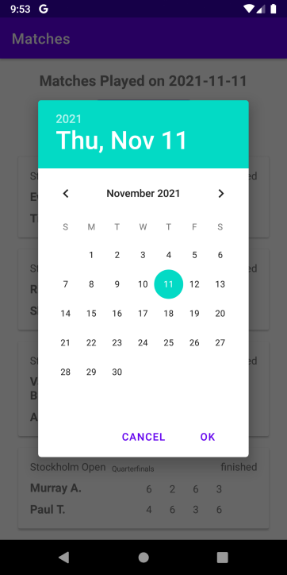

# CSCI 4237 - Tennis Data

For my final project in CSCI 4237 Handheld Devices, I built an app called Tennis Talk. This android app keeps tennis fans up to date with the latest player rankings and match scores. Users can view rankings and click on a player to get more details. They can also view all matches played on a given day. 

## Activities
- **Login Screen** – User enters an email and password. Uses Firebase Auth to log the user in. Includes a button to remember user credentials and a Sign Up button.
- **Sign Up Screen** – User can register a new account. User must enter their password twice to confirm password.
- **Menu Screen**  – After a user signs in, they are brought to the Menu screen where they can choose between the Ranking or Matches screen.
- **Ranking Screen** – Displays current ranking for pro tennis players. User can select ATP (men’s) or WTA (women’s) rankings. Clicking a player opens up more information about them on the web browser. 
- **Matches Screen** – Displays all match played for a given date which the user can specify in a DatePickerDialog. 

## APIs
This app utilizes two endpoints from the [Tennis Live Data API](https://rapidapi.com/sportcontentapi/api/tennis-live-data/).
- Tour Rankings Endpoint - retrieve a list of player rankings for a given tour code (ATP or WTA).
- Matches By Date Endpoint – retrieve a list of matches from all tours and tournaments on a given date.

Login Authentication is provided by Firebase Authentication. Users register and store an email and password on Firebase Auth.

## Localization
Tennis Talk includes language support for both English and Japanese.

## Special Instructions/Limitations
- Matches Activity: Some dates don't have any matches played, thus the Matches Activity might return "No matches found." Some dates I have tested that matches are played, for example, are August 3rd, 2021 and November 11th, 2021.
- Ranking Activity: The Tennis Live Data API has a known issue where a player low ranked player might have a higher ranking than expected. For example, Jurgen Melzer should not be ranked #35.

## Screenshots
### Login Screen

### Sign Up Screen

### Menu Screen

### Ranking Screen

### Matches Screen

